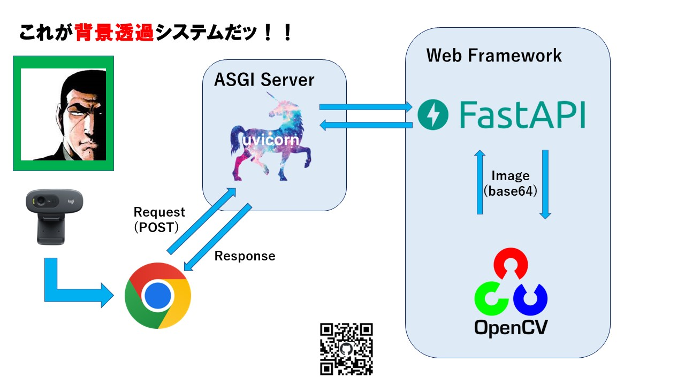

# class_exhibition_color_technology

README may be incomplete as it is under development

デプロイは考えてないのでローカルでの説明になります。(SSL証明書あたり)

最近OpenSSLで脆弱性が見つかったそうなのでデプロイする場合は注意してください

## Overview

2022年度情報工学科2年次クラス展の背景透過に関する技術

## Requirement

### OS

- Ubuntu 20.04(動作確認済)

### Library

- Python 3.10.1
- OpenCV
- FastAPI
- Uvicorn
## Installation

1. Clone this repository

```
git clone https://github.com/GoRuGoo/class_exhibition_color_technology
```

2. Change Directory

```
cd class_exhibition_color_technology
```

3. Install pre-commit

- Reference: <https://pre-commit.com/#installation>

```
pre-commit install
```

4. Install Module

```
pip install -r requirements.txt
```
5. Change Directory
```
cd fastapi/app
```
6. Install OpenSSL
```
sudo apt install openssl
```
6. Issuing private key
```
openssl genrsa 2048 > "keyname"
```
7. Issuing Certificate Signing Request
```
openssl req -new -key "keyname" > "csrname"
```
8. Issuing SSL certificate
```
openssl x509 -req -days 3650 -signkey "keyname" < "csrname" > "crtname"
```

## Usage

1. Change Directory

```
cd class_exhibition_color_technology/fastapi/app
```

2. Run

```
uvicorn main:app --port "portnumber" --host "hostname" --ssl-keyfile="private key path" --ssl-certfile="SSL certificate path"
```

3. Access URL

```
https://"hostname"
```

## Author

- [Yuta Ito](https://github.com/GoRuGoo)




4のなかに5が含まれます

白:(255,255,255)ですね...

